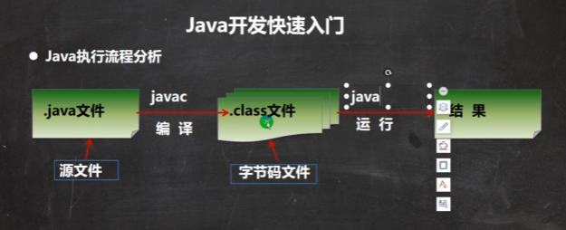
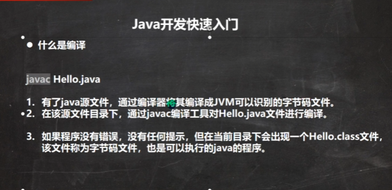
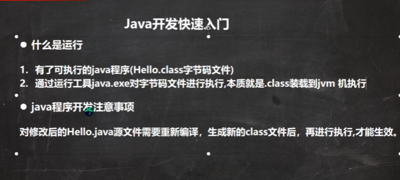
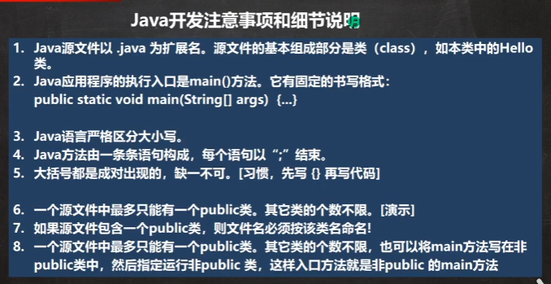

## HelloWorld说明

```java

//这是java的快速入门， 演示java的开发步骤
//对代码的相关说明
//1. public class Hello 表示Hello是一个类,是一个public公有的类
//2. Hello{ } 表示一个类的开始和结束
//3. public static void main(String[] args) 表示一个主方法,即我们程序的入口
//4. main() {} 表示方法的开始和结束
//5. System.out.println("hello,world~"); 表示输出"hello,world~"到屏幕
//6. ;表示语句结束
public class HelloWorld {

	//编写一个main方法
	public static void main(String[] args) {
		System.out.println("韩顺平教育 hello");
	}

}
```


## Java执行流程




## 什么是编译



## 什么是运行




## Java开发注意事项和细节说明




## dos


## 工具


## 学习方法


## API文档使用


## 编码