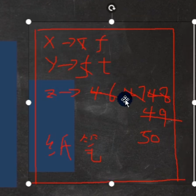

****

**<u>案例都来源于韩顺平老师的整理</u>**


## 转义字符

### Java常见的转义字符

对应关系

```
\t	制表位
\n	换行
\\	\
\"	"
\'	'
\r	回车
```


### 练习一

```java
package chapter01;

/**
 * Author: fang
 * Date:   2022-01-09 10:45 星期日
 * Class:  ChangeChar
 **/
//演示转义字符的使用
public class ChangeChar {

    //编写一个main方法
    public static void main(String[] args) {

        //\t  ：一个制表位，实现对齐的功能
        System.out.println("北京\t天津\t上海");
        // \n  ：换行符
        System.out.println("jack\nsmith\nmary");
        // \\  ：一个\  \\
        System.out.println("C:\\Windows\\System32\\cmd.exe");
        System.out.println("C:\\\\Windows\\\\System32\\\\cmd.exe");
        // \"  :一个"
        System.out.println("老子说:\"上善若水\"");
        // \'  ：一个'
        System.out.println("老子说:\'上善若水\'");

        // \r  :一个回车  System.out.println("上善\r若水");
        // 解读
        // 1. 输出  上善
        // 2. \r表示回车
        System.out.println("上善\r若水"); //若水
    }

}


```


结果：

```
北京	天津	上海
jack
smith
mary
C:\Windows\System32\cmd.exe
C:\\Windows\\System32\\cmd.exe
老子说:"上善若水"
老子说:'上善若水'
若水

Process finished with exit code 0

```


### 练习二


```java
package chapter01;

/**
 * Author: fang
 * Date: 2022/1/910:27
 **/
public class ChangeCharExer01 {

    public static void main(String[] args) {

        System.out.println("书名\t作者\t价格\t销量\n三国\t罗贯中\t120\t1000");

    }
}

```

结果：

```
书名	作者	价格	销量
三国	罗贯中	120	1000

Process finished with exit code 0

```


## 注释(comment)

用于注解说明解释程序的文字就是注释，注释提高了代码的阅读性（可读性）；注释
是**一个程序员必须要具有的良好编程习惯**。将自己的思想通过注释先整理出来，再用
代码去体现。【举例]

Java中的注释类型

1. 单行注释

   基本格式
   格式： //注释文字

2. 多行注释

   基本格式
   格式： /* 注释文字 */

3. 文档注


 使用细节
1)被注释的文字，不会被JVM（java虚拟机）解释执行
2)多行注释里面不允许有多行注释嵌套


### 单行注释

```java
//基本格式：
//注释文字
```


### 多行注释

```java
基本格式
/* 注释文字*/
```


```java
package chapter01;

/**
 * Author: fang
 * Date:   2022-01-09 11:06 星期日
 * Class:  Comment01
 **/
//演示注释使用
public class Comment01 {

    //编写一个main方法
    public static void main(String[] args) {

        //单行注释

        //多行注释
		/* 	示意 => 可读性很好
			下面代码完成 两个数相加
			定义变量

			注释
			注释
			int n1 = 10;...
			System.out.println("ok~~");
			*/
        int n1 = 10;
        int n2 = 30;
        //求和
        int sum = n1 + n2;
        //输出结果
        System.out.println("结果=" + sum);
    }
}

```


### 文档注释

文档注释：
注释内容可以被JDK提供的工具 javadoc 所解析，生成一套以网页文件形式体现的该
程序的说明文档,一般写在类


#### 基本格式

如何生成对应的文档注释

javadoc -d 文件夹名 -xx -yy Comment02.java

#### 应用实例

```
PS C:\java\javaAll\java基础\代码\chapter01> javadoc -d d:\\temp -author -version Comment02.java
正在加载源文件Comment02.java... 
正在构造 Javadoc 信息... 
标准 Doclet 版本 1.8.0_191
正在构建所有程序包和类的树...
正在生成d:\temp\chapter01\Comment02.html...
正在生成d:\temp\chapter01\package-frame.html...
正在生成d:\temp\chapter01\package-summary.html...
正在生成d:\temp\chapter01\package-tree.html...
正在生成d:\temp\constant-values.html...
正在构建所有程序包和类的索引...
正在生成d:\temp\overview-tree.html...
正在生成d:\temp\index-all.html...
正在生成d:\temp\deprecated-list.html...
正在构建所有类的索引...
正在生成d:\temp\allclasses-frame.html...
正在生成d:\temp\allclasses-noframe.html...
正在生成d:\temp\index.html...
正在生成d:\temp\help-doc.html...
PS C:\java\javaAll\java基础\代码\chapter01>

```


## 变量

### 基本概念

**变量是程序的基本组成单位**

基本要素：类型+名称+值

变量相当于内存中一个数据存储空间的表示，你可以把变量看做是一个房间的门
牌号，通过门牌号我们可以找到房间，而通过变量名可以访问到变量(值)。

```
变量使用的基本步骤
1)声明变量
int a;
2) 赋值
a = 60;
3)使用System.out.println(a);
//也可以一步到位[int a = 60; 通常都是一步完成]
```


#### 演示1：

```java

public class Var01 { 

	//编写一个main方法
	public static void main(String[] args) {

		//声明变量
		int a;
		a = 100;
		System.out.println(a); 

		//还可以这样使用
		int b = 800;
		System.out.println(b); 
	}
}
```


#### 演示2：

```java

public class Var02 { 

	//编写一个main方法
	public static void main(String[] args) {
		//记录人的信息
		int age = 30;
		double score = 88.9;
		char gender = '男';
		String name = "king";
		//输出信息, 快捷键
		System.out.println("人的信息如下:");
		System.out.println(name);
		System.out.println(age);
		System.out.println(score);
		System.out.println(gender);

		
	}
}
```


#### 注意事项：

```
变量使用注意事项
1.变量表示内存中的一个存储区域 [不同的变量，类型不同，占用的空间大小不同，
比如: int 4 个字节, double 就是 8个字节]
2.该区域有自己的名称[变量名]和类型[数据类型]
3.变量必须先声明，后使用，即有顺序
4.该区域的数据可以在同一类型范围内不断变化
5.变量在同一作用域内不能重名
6.变量=变量名+值+数据类型，这一点请大家注意。变量三要素
```


#### 细节

```java


public class VarDetail { 

	//编写一个main方法
	public static void main(String[] args) {
		//变量必须先声明，后使用, 即有顺序
		int a = 50;//int
		System.out.println(a);//50
		//该区域的数据/值可以在同一类型范围内不断变化
		//a = "jack"; //×
		a = 88; //对
		System.out.println(a);//88
		
		//变量在同一个作用域内不能重名
		//int a = 77;//错误


	}
}

class Dog {
	public static void main(String[] args) {
		int a = 666;//对
	}
}
```


### +号的使用

1.当左右两边都是数值型时，做加法运算

2.当左右两边有一方为字符串时，则做拼接运输

3.从左向右运算(没有优先级高的时)

```java
/**
 * Author: fang
 * Date:   2022-01-09 13:17 星期日
 * Class:  Plus01
 **/
public class Plus01 {
    public static void main(String[] args) {

        System.out.println(100 + 11);
        System.out.println("100" + 11);
        System.out.println(100 + 11 + "hello");
        System.out.println("hello" + 100 + 11);
    }
}

```

结果：

```
111
10011
111hello
hello10011

Process finished with exit code 0
```


### 数据类型

每一种数据都定义了明确的数据类型（Java是强数据类型），在内存中分配了不同大小的内存空间（字节）


上图说明
1.java数据类型分为两大类基本数据类型，引用类型
2.基本数据类型有8种 数值型 [byte , short , int , long , float ,double] char , boolean
3.引用类型[类，接口，数组]


#### 整型

##### 基本介绍

Java的整数类型就是用于存放整数值的，比如 12，30,3456等等


##### 细节

```
1．Java各整数类型有固定的范围和字段长度，不受具体OS[操作系统]的影响，以
保证java程序的可移植性。

2. Java的整型常量（具体值）默认为 int 型，声明long型常量须后加 "l’或‘L’
3. java程序中变量常声明为int型，除非不足以表示大数，才使用long
4. bit: 计算机中的最小存储单位。byte:计算机中基本存储单元,
	1byte = 8 bit。
   [二进制再详细说，简单举例一个 byte 3 和 short 3 ]
   思考题：long 类型，有几个 bit
   [8 * 8 = 64 bit]
  
```

```java
	//Java的整型常量（具体值）默认为 int 型，声明long型常量须后加‘l’或‘L’
	int n1 = 1;//4个字节
	//int n2 = 1L;//错误写法 
	long n3 = 1L;//对
```


##### 内存中表现


#### 浮点型


##### 基本介绍

Java的浮点类型可以表示一个小数 例如123.4 ， 7.8 ，0.12


##### 细节


##### 演示代码

```java

public class FloatDetail { 

	//编写一个main方法
	public static void main(String[] args) {

		//Java 的浮点型常量(具体值)默认为double型，声明float型常量，须后加‘f’或‘F'
		//float num1 = 1.1; //对不对?错误
		float num2 = 1.1F; //对的
		double num3 = 1.1; //对
		double num4 = 1.1f; //对

		//十进制数形式：如：5.12       512.0f        .512   (必须有小数点）
		double num5 = .123; //等价 0.123
		System.out.println(num5);
		//科学计数法形式:如：5.12e2 [5.12 * 10的2次方 ]      5.12E-2   [] 
		System.out.println(5.12e2);//512.0
		System.out.println(5.12E-2);//0.0512


		//通常情况下，应该使用double型，因为它比float型更精确。
		//[举例说明]double num9 = 2.1234567851;float num10 =  2.1234567851F;
		double num9 =  2.1234567851;
		float num10 =  2.1234567851F;
		System.out.println(num9);
		System.out.println(num10);

		//浮点数使用陷阱: 2.7 和 8.1 / 3  比较
		//看看一段代码
		double num11 = 2.7;
		double num12 = 2.7;	//8.1 / 3; //2.7
		System.out.println(num11);//2.7
		System.out.println(num12);//接近2.7的一个小数，而不是2.7
		//得到一个重要的使用点: 当我们对运算结果是小数的进行相等判断是，要小心
		//应该是以两个数的差值的绝对值，在某个精度范围类判断
		if( num11 == num12) {
			System.out.println("num11 == num12 相等");
		}
		//正确的写法 , ctrl + / 注释快捷键, 再次输入就取消注释
		if(Math.abs(num11 - num12) < 0.000001 ) {
			System.out.println("差值非常小，到我的规定精度，认为相等...");
		}
		// 可以通过java API  来看 下一个视频介绍如何使用API
		System.out.println(Math.abs(num11 - num12));
		//细节:如果是直接查询得的的小数或者直接赋值，是可以判断相等
		
	}
}
```


#### 字符类型

##### 基本介绍

字符类型可以表示**单个字符**,字符类型是char, char是两个字节(可以存放汉字),
多个字符我们用字符串String

##### 演示

```java
package chapter03;

/**
 * Author: fang
 * Date:   2022-01-09 13:48 星期日
 * Class:  Char01
 **/
public class Char01 {
    public static void main(String[] args) {
        char c1 = 'a';
        char c2 = '\t';
        char c3 = '韩';
        char c4 = 97; //说明: 字符类型可以直接存放一个数字
        //修改快捷键
        //删除当前行的快捷键使用 ctrl+shif+k => ctrl+ k
        System.out.println(c1);
        System.out.println(c2);
        System.out.println(c3);
        System.out.println(c4);//当输出c4时候，会输出97表示的字符 => 编码的概念

    }
}

```

结果：

```
a
	
韩
a

Process finished with exit code 0
```


##### 字符类型使用细节

```
1．字符常量是用单引号('')括起来的单个字符。例如:
char c1 = 'a'；char c2 = "中'; char c3 = "9';
2.Java中还允许使用转义字符'\' 来将其后的字符转变为特殊字符型常量。
   例如：char c3 ='\n'；// "\n'表示换行符
3.在java中, char的本质是一个整数，在输出时，是unicode码对应的字符。
   http://tool.chinaz.com/Tools/Unicode.aspx
4.可以直接给char赋一个整数,然后输出时，会按照对应的unicode字符输出[97]
5.char类型是可以进行运算的，相当于一个整数，因为它都对应有Unode码.
```


##### 细节代码

```java
package chapter03;

/**
 * Author: fang
 * Date:   2022-01-09 13:55 星期日
 * Class:  CharDetail
 **/

public class CharDetail {

    //编写一个main方法
    public static void main(String[] args) {

        //在java中，char的本质是一个整数，在默认输出时，是unicode码对应的字符
        //要输出对应的数字，可以(int)字符
        char c1 = 97;
        System.out.println(c1); // a

        char c2 = 'a'; //输出'a' 对应的 数字
        System.out.println((int)c2);
        char c3 = '韩';
        System.out.println((int)c3);//38889
        char c4 = 38889;
        System.out.println(c4);//韩

        //char类型是可以进行运算的，相当于一个整数，因为它都对应有Unicode码.

        System.out.println('a' + 10);//107

        //课堂小测试
        char c5 = 'b' + 1;//98+1==> 99
        System.out.println((int)c5); //99
        System.out.println(c5); //99->对应的字符->编码表ASCII(规定好的)=>c
    }
}
```


结果

```
a
97
38889
韩
107
99
c

Process finished with exit code 0
```


##### 字符类型的本质

```
1．字符型 存储到 计算机中，需要将字符对应的码值（整数）找出来，
比如'a"：
	存储: 'a' ==> 码值 97 ==> 二进制（110 0001） ==> 存储
	读取：二进制（110 0001） => 97 ===> 'a' => 显示

2. 字符和码值的对应关系是通过字符编码表决定的(是规定好)

● 介绍一下字符编码表 [sublime测试]
ASCII (ASCII 编码表 一个字节表示 ，一个128个字符，实际上一个字节可以表示256哥字符)
Unicode (Unicode 编码表 固定大小的编码 使用两个字节来表示字符，字母和汉字统一占用两个字节，这样浪费空间 )
---只是规范 目前实际实现的unicode编码只要有三种：UTF-8,UCS-2和UTF-16，三种unicode字符集之间可以按照规范进行转换
utf-8（编码表，大小可变的编码 字母使用1个字节，汉字使用3个字节）
gbk (可以表示汉字，而且范围广，字母使用1个字节，汉字2个字节)
gb2312 (可以表示汉字, gb2312 < gbk)
bia5码(繁体中文，台湾，香港)

```


#### 布尔类型

##### 基本介绍

1．布尔类型也叫boolean类型，boolean类型只允许取值true和false，null
2．boolean类型占1个字节。
3.boolean类型适于逻辑运算，一般用于流程控制

- if条件控制语句;
- while循环控制语句;
- do-while循环控制语句;
- for循环控制语句

```java
public class Boolean01 { 
	//编写一个main方法
	public static void main(String[] args) {
		//演示判断成绩是否通过的案例
		//定义一个布尔变量
		boolean isPass = true;//
		if(isPass == true) {
			System.out.println("考试通过，恭喜");
		} else {
			System.out.println("考试没有通过，下次努力");
		}
	}
}
```


### 数据类型转换


##### 自动类型转换


```java

public class AutoConvert { 

	//编写一个main方法
	public static void main(String[] args) {
		//演示自动转换
		int num = 'a';//ok char -> int
		double d1 = 80; //ok int -> double
		System.out.println(num);//97
		System.out.println(d1);//80.0

	}
}
```


###### 自动类型转换细节

```
1： 有多种类型的数据混合运算时，系统首先自动将所有数据转换成容量最大的那种数据类型，然后再进行计算
2: 当我们把精度(容量)大 的数据类型赋值给精度(容量)小 的数据类型时，就会报错，反之就会进行自动类型转换。
3: (byte, short) 和 char之间不会相互自动转换
4: byte，short，char  他们三者可以计算，在计算时首先转换为int类型
5.boolean不参与转换
6.自动提升原则：表达式结果的类型自动提升为 操作数中最大的类型
```


```java
package chapter03;

/**
 * Author: fang
 * Date:   2022-01-09 14:19 星期日
 * Class:  AutoConvertDetail
 **/
//自动类型转换细节
public class AutoConvertDetail {

    //编写一个main方法
    public static void main(String[] args) {
        //细节1： 有多种类型的数据混合运算时，
        //系统首先自动将所有数据转换成容量最大的那种数据类型，然后再进行计算
        int n1 = 10; //ok
        //float d1 = n1 + 1.1;//错误 n1 + 1.1 => 结果类型是 double
        //double d1 = n1 + 1.1;//对 n1 + 1.1 => 结果类型是 double
        float d1 = n1 + 1.1F;//对 n1 + 1.1 => 结果类型是 float

        //细节2: 当我们把精度(容量)大 的数据类型赋值给精度(容量)小 的数据类型时，
        //就会报错，反之就会进行自动类型转换。
        //
        //int n2 = 1.1;//错误 double -> int

        //细节3: (byte, short) 和 char之间不会相互自动转换
        //当把具体数赋给 byte 时，(1)先判断该数是否在byte范围内，如果是就可以
        byte b1 = 10; //对  , -128-127
        // int n2 = 1; //n2 是int
        // byte b2 = n2; //错误，原因： 如果是变量赋值，判断类型
        //
        // char c1 = b1; //错误， 原因 byte 不能自动转成 char
        //
        //

        //细节4: byte，short，char  他们三者可以计算，在计算时首先转换为int类型

        byte b2 = 1;
        byte b3 = 2;
        short s1 = 1;
        //short s2 = b2 + s1;//错, b2 + s1 => int
        int s2 = b2 + s1;//对, b2 + s1 => int

        //byte b4 = b2 + b3; //错误: b2 + b3 => int
        //

        //boolean 不参与转换
        boolean pass = true;
        //int num100 = pass;// boolean 不参与类型的自动转换

        //自动提升原则： 表达式结果的类型自动提升为 操作数中最大的类型
        //看一道题

        byte b4 = 1;
        short s3 = 100;
        int num200 = 1;
        float num300 = 1.1F;

        double num500 = b4 + s3 + num200 + num300; //float -> double
    }
}
```


##### 强制类型转换

###### 介绍

自动类型转换的逆过程，将容量大的数据类型转换为容量小的数据类型。使用时要
加上强制转换符（），但可能造成精度降低或溢出,格外要注意。

###### 演示


```java
package chapter03;

/**
 * Author: fang
 * Date:   2022-01-09 14:31 星期日
 * Class:  ForceConvert
 **/
public class ForceConvert {
    public static void main(String[] args) {
        //演示强制类型转换
        int n1 = (int)1.9;
        System.out.println("n1=" + n1);//1, 造成精度损失

        int n2 = 2000;
        byte b1 = (byte)n2;
        System.out.println("b1=" + b1);//造成 数据溢出
    }
}

```


结果

```
n1=1
b1=-48

Process finished with exit code 0

```


###### 细节

```
强制类型转换细节说明：
1．当进行数据的大小从 大->小，就需要使用到强制转换

2. 强转符号只针对于最近的操作数有效，往往会使用小括号提升优先级
//int x = (int)10*3.5+6*1.5;
int y = (int)(10*3.5+6*1.5);
System.out.println(y);

3.char类型可以保存 int的常量值，但不能保存int的变量值，需要强转
char c1 = 100;//ok
int m = 100;//ok
char c2 = m;//错误
char c3 = (char)m;//ok
System.out.printin(c3);//'d'
4．byte和short char类型在进行运算时，当做int类型处理。
```


```java

public class ForceConvertDetail { 

	//编写一个main方法
	public static void main(String[] args) {
		
		//演示强制类型转换
		//强转符号只针对于最近的操作数有效，往往会使用小括号提升优先级
		//int x = (int)10*3.5+6*1.5;//编译错误： double -> int 
		int x = (int)(10*3.5+6*1.5);// (int)44.0 -> 44
		System.out.println(x);//44

		char c1 = 100; //ok
		int m = 100; //ok
		//char c2 = m; //错误
		char c3 = (char)m; //ok
		System.out.println(c3);//100对应的字符, d字符

	}
}
```


#### 基本数据类型练习

```java
判断是否能够通过编译
1. short s = 12; //ok
   s = s-9;//错误 int ->short
  
2. byte b = 10; //ok
   b = b + 11;//错误 int->byte
   b = (byte)(b+11)；//正确，使用强转

3. char c = 'a'；//ok
   int i = 16;//ok
   float d = .314F；//ok
   double result = c + i + d; //ok float->double

4. byte b = 16; //ok
   short s = 14; //ok
   short t = s + b; //错误int ->short
```


#### 基本数据类型和String类型的转换


##### 介绍

在程序开发中，我们经常需要将基本数据类型转成String类型。或者将String类型

转成基本数据类型


基本类型转String类型

语法： 将基本类型的值+“” 即可


String类型转基本数据类型

语法：通过基本类型的包装类调用parseXX方法即可


##### 演示

```java

public class StringToBasic { 

	//编写一个main方法
	public static void main(String[] args) {
		
		//基本数据类型->String
		int n1 = 100;
		float f1 = 1.1F;
		double d1 = 4.5;
		boolean b1 = true;
		String s1 = n1 + "";
		String s2 = f1 + "";
		String s3 = d1 + "";
		String s4 = b1 + "";
		System.out.println(s1 + " " + s2 + " " + s3 + " " + s4);

		//String->对应的基本数据类型
		String s5 = "123";
		//会在OOP 讲对象和方法的时候回详细
		//解读 使用 基本数据类型对应的包装类，的相应方法，得到基本数据类型
		int num1 = Integer.parseInt(s5);
		double num2 = Double.parseDouble(s5);
		float num3 = Float.parseFloat(s5);
		long num4 = Long.parseLong(s5);
		byte num5 = Byte.parseByte(s5);
		boolean b = Boolean.parseBoolean("true");
		short num6 = Short.parseShort(s5);

		System.out.println("===================");
		System.out.println(num1);//123
		System.out.println(num2);//123.0
		System.out.println(num3);//123.0
		System.out.println(num4);//123
		System.out.println(num5);//123
		System.out.println(num6);//123
		System.out.println(b);//true

		//怎么把字符串转成字符char -> 含义是指 把字符串的第一个字符得到
		//解读  s5.charAt(0) 得到 s5字符串的第一个字符 '1'
		System.out.println(s5.charAt(0));
		
	}
}
```


##### 注意事项

1.在将String类型 转成基本数据类型时，要 确保String类型能够转成有效的数据，

比如 我们可以把 “123” 转成整数，但是不能把 “hello” 转成一个整数

2.如果格式不正确，就会抛出异常，程序就会终止，这个问题在异常章节处理


### 本章作业


```java
public class Homework01 { 

	//编写一个main方法
	public static void main(String[] args) {
		
		int n1;
        n1 = 13;
        int n2;
        n2 = 17;
        int n3;
        n3 = n1 + n2;
        System.out.println("n3 = " + n3);//30
        int n4 = 38;
        int n5 = n4 - n3;
        System.out.println("n5 = " + n5);//8

	}
}
```


```java
package chapter03;

/**
 * Author: fang
 * Date:   2022-01-09 15:01 星期日
 * Class:  Homework
 **/
public class Homework02 {
    public static void main(String[] args) {
        //使用char类型 分别保存 \n \t \r  \\ 1 2 3 等字符 并打印输出
        char c1 = '\n';
        char c2 = '\t';
        char c3 = '\r';
        char c4 = '\\';
        char c5 = '1';
        char c6 = '2';
        char c7 = '3';

        System.out.println(c1);
        System.out.println(c2);
        System.out.println(c3);
        System.out.println(c4);
        System.out.println(c5);
        System.out.println(c6);
        System.out.println(c7);

    }
}

```


```java

public class Homework03 { 

	//编写一个main方法
	public static void main(String[] args) {
		//编程，保存两本书名，用+拼接，看效果。保存两个性别，
		//用加号拼接，看效果。保存两本书价格，用加号拼接，看效果
		
		String book1 = "天龙八部";
		String book2 = "笑傲江湖";
		System.out.println(book1 + book2);//天龙八部笑傲江湖

		//性别应该使用char保存
		char c1 = '男';
		char c2 = '女';
		System.out.println(c1 + c2);//得到  男 字符码值 + 女 字符码值

		//保存两本书价格
		double price1 = 123.56;
		double price2 = 100.11;
		System.out.println(price1 + price2);//就是 123.56+100.11
	}
}
```


```java

public class Homework04 { 

	//编写一个main方法
	public static void main(String[] args) {
		/*
		 姓名	年龄	成绩	性别	爱好
     	xx		xx	xx	xx	xx

		要求：
		1) 用变量将姓名、年龄、成绩、性别、爱好存储
		2) 使用+
		3) 添加适当的注释
		4) 添加转义字符, 使用一条语句输出

		 */
		//姓名
		String name = "jack";
		int age = 20;
		double score = 80.9;
		char gender = '男';
		String hobby = "打篮球";
		//输出了信息, 可以使用换行
		System.out.println("姓名\t年龄\t成绩\t性别\t爱好\n" + name + "\t" 
			+ age + "\t" + score + "\t" + gender + "\t" + hobby);
	}
}
```


## 运算符

### 运算符介绍

运算符是一种特殊的符号，用以表示数据的运算、赋值和比较等。
1. 算术运算符
2. 赋值运算符
3. 关系运算[北较运算符]
4. 逻辑运算符
5. 位运算符 [需要二进制基础]
6. 三元运算符


### 算术运算符

算术运算符是对数值类型的变量进行运算的，在Java程序中使用的非常多。


案例演示

```java
/**
 * 演示算术运算符的使用 
 */
public class ArithmeticOperator { 

	//编写一个main方法
	public static void main(String[] args) {
		// /使用
		System.out.println(10 / 4); //从数学来看是2.5, java中 2
		System.out.println(10.0 / 4); //java是2.5
		// 注释快捷键 ctrl + /, 再次输入 ctrl + / 取消注释
		double d = 10 / 4;//java中10 / 4 = 2, 2=>2.0 
		System.out.println(d);// 是2.0

		// % 取模 ,取余
		// 在 % 的本质 看一个公式!!!! a % b = a - a / b * b
		// -10 % 3 => -10 - (-10) / 3 * 3 = -10 + 9 = -1
		// 10 % -3 = 10 - 10 / (-3) * (-3) = 10 - 9 = 1
		// -10 % -3 =  (-10) - (-10) / (-3) * (-3) = -10 + 9 = -1
		System.out.println(10 % 3); //1

		System.out.println(-10 % 3); // -1
		System.out.println(10 % -3); //1
		System.out.println(-10 % -3);//-1

		//++的使用
		//
		int i = 10;
		i++;//自增 等价于 i = i + 1; => i = 11
		++i;//自增 等价于 i = i + 1; => i = 12
		System.out.println("i=" + i);//12

		/*
		作为表达式使用
        前++：++i先自增后赋值
        后++：i++先赋值后自增
		 */
		int j = 8;
		//int k = ++j; //等价 j=j+1;k=j; 
		int k = j++; // 等价 k =j;j=j+1;
		System.out.println("k=" + k + "j=" + j);//8 9
	}
}
```


面试题


```java
//练习

public class ArithmeticOperatorExercise01 { 

	//编写一个main方法
	public static void main(String[] args) {
		
		// int i = 1;//i->1
		// i = i++; //规则使用临时变量: (1) temp=i;(2) i=i+1;(3)i=temp;
		// System.out.println(i); // 1


		// int i=1;
		// i=++i; //规则使用临时变量: (1) i=i+1;(2) temp=i;(3)i=temp;
		// System.out.println(i); //2
		// 
		// 测试输出
		int i1 = 10;
	    int i2 = 20;
        int i = i1++;
        System.out.print("i="+i);//10
        System.out.println("i2="+i2);//20
        i = --i2; 
        System.out.print("i="+i);//19
        System.out.println("i2="+i2);//19

	}
}
```


课堂练习


```java
package chapter04;

/**
 * Author: fang
 * Date:   2022-01-09 21:17 星期日
 * Class:  ArithmeticOperatorExercise02
 **/
public class ArithmeticOperatorExercise02 {

    public static void main(String[] args) {

        //1.需求:
        //假如还有59天放假，问：合xx个星期零xx天
        //2.思路分析
        //(1) 使用int 变量 days 保存 天数
        //(2) 一个星期是7天 星期数weeks： days / 7 零xx天leftDays days % 7
        //(3) 输出
        int days = 14;
        int week = (int)(days / 7) ;
        int last = days % 7 ;
        System.out.println(days +"天 合计 "+ week +"星期 零 " + last + " 天" );

        //1.需求
        //定义一个变量保存华氏温度，华氏温度转换摄氏温度的公式为
        //：5/9*(华氏温度-100),请求出华氏温度对应的摄氏温度
        //
        //2思路分析
        //(1) 先定义一个double huaShi 变量保存 华氏温度
        //(2) 根据给出的公式，进行计算即可5/9*(华氏温度-100)
        //    考虑数学公式和java语言的特性
        //(3) 将得到的结果保存到double sheShi
        double huashi = 111.2;
        double sheshi = 5.0 / 9 * (huashi - 100);

        System.out.println( "华氏温度 "+ huashi +" 对应的摄氏温度为 ：" + sheshi);
    }
}

```


### 关系运算符

介绍
1.关系运算符的结果都是boolean型，也就是要么是true，要么是false

2.关系表达式 经常用在 if结构的条件中或循环结构的条件中


演示

```java
//演示关系运算符的使用
//

public class RelationalOperator { 

	//编写一个main方法
	public static void main(String[] args) {

		int a = 9;  //老韩提示:  开发中，不可以使用  a, b 
		int b = 8;
		System.out.println(a > b); //T 
		System.out.println(a >= b);  //T
		System.out.println(a <= b); //F
		System.out.println(a < b);//F
		System.out.println(a == b); //F
		System.out.println(a != b); //T
		boolean flag = a > b; //T
		System.out.println("flag=" + flag);
	}
}
```


● 细节说明
1)关系运算符的结果都是boolean型，也就是要么是true,要么是false。
2)关系运算符组成的表达式，我们称为**关系表达式**。a > b
3)比较运算符"=="不能误写成"="


### 逻辑运算符

● 介绍
用于连接多个条件（多个关系表达式），最终的结果也是一个boolean值。


```java
/**
 * 演示逻辑运算符的使用
 */

public class LogicOperator01 { 

	//编写一个main方法
	public static void main(String[] args) {
		//&&短路与  和 & 案例演示
		int age = 50;
		if(age > 20 && age < 90) {
			System.out.println("ok100");
		}

		//&逻辑与使用
		if(age > 20 & age < 90) {
			System.out.println("ok200");
		}

		//区别
		int a = 4;
		int b = 9;
		//对于&&短路与而言，如果第一个条件为false ,后面的条件不再判断
		//对于&逻辑与而言，如果第一个条件为false ,后面的条件仍然会判断
		if(a < 1 & ++b < 50) {
			System.out.println("ok300");
		}
		System.out.println("a=" + a + " b=" + b);// 4 10

		

	}
}
```


```java
//演示| || 使用

public class LogicOperator02 { 

	//编写一个main方法
	public static void main(String[] args) {

		//||短路或  和 |逻辑或 案例演示
		//|| 规则: 两个条件中只要有一个成立，结果为true,否则为false
		//| 规则: 两个条件中只要有一个成立，结果为true,否则为false
		int age = 50;
		if(age > 20 || age < 30) {
			System.out.println("ok100");
		}

		//&逻辑与使用
		if(age > 20 | age < 30) {
			System.out.println("ok200");
		}

		//看看区别
		//(1)||短路或：如果第一个条件为true，
		//则第二个条件不会判断，最终结果为true，效率高
		//(2)| 逻辑或：不管第一个条件是否为true，第二个条件都要判断，效率低
		int a = 4;
		int b = 9;
		if( a > 1 || ++b > 4) { // 可以换成 | 测试
			System.out.println("ok300");
		}
		System.out.println("a=" + a + " b=" + b); //4 10


	}
}
```


```java
//!和^案例演示

public class InverseOperator { 

	//编写一个main方法
	public static void main(String[] args) {

		//! 操作是取反 T->F  , F -> T
		System.out.println(60 > 20); //T
		System.out.println(!(60 > 20)); //F

		//a^b: 叫逻辑异或，当 a 和 b 不同时，则结果为true, 否则为false
		boolean b = (10 > 1) ^ ( 3 > 5);
		System.out.println("b=" + b);//T
	}
}
```


练习题





验证

```java
//验证

public class Test { 

	//编写一个main方法
	public static void main(String[] args) {

		// int x = 5;
		// int y=5;
		// if(x++==6 & ++y==6){ //逻辑与
		// 	x = 11;
		// }
		// System.out.println("x="+x+",y="+y);
		// //6, 6
		// int x = 5,y = 5;

		// if(x++==6 && ++y==6){
		// 	x = 11;
		// }
		// System.out.println("x="+x+",y="+y);
		// //6, 5
		// 
		// int x = 5,y = 5;
		// if(x++==5 | ++y==5){
		// 	x =11;
		// }
		// System.out.println("x="+x+",y="+y);
		//11, 6
		//
		// int x = 5,y = 5;
		// if(x++==5 || ++y==5){
		// 	x =11;
		// }
		// System.out.println("x="+x+",y="+y);
		//11, 5
		//
		//
		boolean x=true;
		boolean y=false;
		short z=46;
		if( (z++==46)&& (y=true) )   z++;  
		if((x=false) || (++z==49))  z++; 
		System. out.println("z="+z); //50 

	}
}
```


### 赋值运算符

●介绍
赋值运算符就是将某个运算后的值,赋给指定的变量。
● 赋值运算符的分类
基本赋值运算符 = 	int a = 100;
复合赋值运算符
+=， -=，/=，*=，%= 等

重点讲解一个 += ，

其它的使用是一个道理
.
a += b; [等价 ？  a = a + b; ]
a -= b; [等价？ a=  a - b]


```java
//演示赋值运算符的使用

public class AssignOperator { 

	//编写一个main方法
	public static void main(String[] args) {

		int n1 = 10;
		n1 += 4;// n1 = n1 + 4;
		System.out.println(n1); // 14
		n1 /= 3;// n1 = n1 / 3;//4
		System.out.println(n1); // 4

		//复合赋值运算符会进行类型转换
		byte b = 3;
		b += 2; // 等价 b = (byte)(b + 2);
		b++; // b = (byte)(b+1);

		
	}
}
```


### 三元运算符

●基本语法
条件表达式？表达式1:表达式2;
1.如果条件表达式为true,运算后的结果是表达式1；
2.如果条件表达式为false,运算后的结果是表达式2；

● 案例演示
int a = 10;
int b = 99;
int result = :

```java
//三元运算符使用

public class TernaryOperator { 

	//编写一个main方法
	public static void main(String[] args) {

		int a = 10;
		int b = 99;
		// 解读
		// 1. a > b 为 false
		// 2. 返回 b--, 先返回 b的值,然后在 b-1
		// 3. 返回的结果是99 
		int result = a > b ? a++ : b--;
		System.out.println("result=" + result);
		System.out.println("a=" + a);
		System.out.println("b=" + b);

	}
}
```


细节

1. 表达式1和表达式2 要为可以赋给接受变量的类型（或者可以自动转换）
2. 三元运算符可以转成if--else 语句


```java
//三元运算符细节

public class TernaryOperatorDetail { 

	//编写一个main方法
	public static void main(String[] args) {
		//表达式1和表达式2要为可以赋给接收变量的类型
		//(或可以自动转换/或者强制转换)
		int a = 3;
		int b = 8;
		int c = a > b ? (int)1.1 : (int)3.4;//可以的
		double d = a > b ? a : b + 3;//可以的，满足 int -> double
	}
}
```


```java

public class TernaryOperatorExercise { 

	//编写一个main方法
	public static void main(String[] args) {
		//案例：实现三个数的最大值
		int n1 = 553;
		int n2 = 33;
		int n3 = 123;
		//思路
		//1. 先得到 n1 和 n2 中最大数 , 保存到 max1
		//2. 然后再 求出 max1 和  n3中的最大数，保存到 max2
		
		int max1 = n1 > n2 ? n1 : n2;
		int max2 = max1 > n3 ? max1 : n3;
		System.out.println("最大数=" + max2);

		//使用一条语句实现, 推荐使用上面方法
		//老师提示: 后面我们可以使用更好方法,比如排序
		// int max = (n1 > n2 ? n1 : n2) > n3 ? 
		// 				(n1 > n2 ? n1 : n2) : n3;
		// System.out.println("最大数=" + max);	
		// 	
	}
}
```


### 运算符优先级

运算符优先级
1.运算符有不同的优先级，所谓优先级就是表达式运算中的运算顺序。
如右表，上一行运算符总优先于下一行。
2.只有单目运算符、赋值运算符是从右向左运算的。


### 标识符的命名规则和规范

```
• 标识符概念
1．Java对各种变量、方法和类等命名时使用的字符序列称为标识符

2. 凡是自己可以起名字的地方都叫标识符 int num1 = 90;
   
• 标识符的命名规则(必须遵守)
   
  1．由26个英文字母大小写，0-9，_或 $ 组成
  2．数字不可以开头。	int 3ab = 1;//错误
  3．不可以使用关键字和保留字，但能包含关键字和保留字。
  4.Java中严格区分大小写，长度无限制。int totalNum = 10; int n = 90;
  5.标识符不能包含空格。int a b = 90;//错误

```


命令规范


### 关键字


### 保留字

```
介绍
Java保留字：现有Java版本尚未使用，但以后版本可能会作为关键字使用。自己命名标识符时要避免使用这些保留字

byValue、cast、future、generic、inner,opeator,outer,rest,var ,goto ,const
```


### 进制

```
• 进制介绍
对于整数，有四种表示方式：
1．二进制：0,1，满2进1.以Ob或0B开头。
2．十进制：0-9，满10进1。
3.八进制：0-7，满8进1.以数字0开头表示。
4.十六进制：0-9及A(10)-F(15)，满16进1. 以0x或0X开头表示。此处的A-F不区分大小写。
```


```java
//演示四种进制
//
public class BinaryTest { 

	//编写一个main方法
	public static void main(String[] args) {

		//n1 二进制
		int n1 = 0b1010;
		//n2 10进制
		int n2 = 1010;
		//n3 8进制
		int n3 = 01010;
		//n4 16进制
		int n4 = 0X10101;
		System.out.println("n1=" + n1);
		System.out.println("n2=" + n2);
		System.out.println("n3=" + n3);
		System.out.println("n4=" + n4);
		System.out.println(0x23A);


	}
}
```


### 进制的转换

win10 自带计算器

HEX 十六进制

DEC 十进制

OCT 八进制

BIN 二进制


#### 二进制转十进制

```

规则：从最低位(右边)开始，将每个位上的数提取出来，乘以2的(位数-1)次方，
然后求和。

案例：请将 0b1011 转成十进制的数
●0b1011 =	1 * 2^(1-1) + 1 * 2^(2-1) + 0 * 2^(3-1) + 1 * 2^(4-1) 
		= 1 + 2 + 0 + 8 = 11
```


#### 八进制转十进制

```
规则：从最低位(右边)开始，将每个位上的数提取出来，乘以8的(位数-1)次方
然后求和。
案例：请将 0234转成十进制的数
0234 = 4 * 8^0 + 3 * 8^1 + 2 * 8^2= 4 + 24 + 128 = 156
```


#### 十六进制转十进制

```
规则：从最低位(右边)开始，将每个位上的数提取出来，乘以16的(位数-1)次方，
然后求和。

案例：请将 0x23A 转成十进制的数
0x23A = 10 * 16^0 + 3 * 16 ^ 1 + 2* 16^2 = 10 + 48 + 512 = 570
```


#### 练习


#### 十进制转二进制

```

规则：将该数不断除以2，直到商为0为止，然后将每步得到的余数倒过来，就是对应
的二进制。


案例:请将34转成二进制 = 
```


#### 十进制转八进制


#### 十进制转十六进制


#### 练习


#### 二进制转八进制


#### 二进制转十六进制


#### 练习


#### 八进制转二进制


省略了首位的0

ob 010 011 111


#### 十六进制转二进制


#### 练习

***


### 位运算


### 二进制在运算中的说明

```
二进制在运算中的说明
1.二进制是逢2进位的进位制, 0、1是基本算符。

2. 现代的电子计算机技术全部采用的是二进制，因为它只使用O、1两个数字符号，
非常简单方便，易于用电子方式实现。计算机内部处理的信息，都是采用二进制
数来表示的。二进制（Binary）数用0和1两个数字及其组合来表示任何数。
进位规则是"逢2进1”，数字1在不同的位上代表不同的值，按从右至左的次序，这个
值以二倍递增。
```


### 原码 反码 补码

```
(背下来)

对于有符号的而言：
1. 二进制的最高位是符号位: 0表示正数,1表示负数(老韩口诀: O->0 1-> -)
2. 正数的原码，反码，补码都一样(三码合一)
3．负数的反码=它的原码符号位不变，其它位取反(0->1,1->0)
4. 负数的补码=它的反码 + 1， 负数的反码 = 负数的补码 - 1
5. 0的反码，补码都是O
6. java没有无符号数，换言之，java中的数都是有符号的
7．在计算机运算的时候，都是以补码的方式来运算的.
8．当我们看运算结果的时候，要看他的原码

```


### 位运算符


```
●java中有7个位运算 ( &， |, ^, ~, >>, << 和 >>>)

分别是 按位与&、按位或|、按位异或^,按位取反~,

它们的运算规则是:
按位与&	两位全为1，结果为1，否则为0
按位或|	两位有一个为1，结果为1，否则为0
按位异或 	两位一个为O,一个为1, 结果为1，否则为0
按位取反。	0->1,1->0

```


```java
//位运算


public class BitOperator { 

	//编写一个main方法
	public static void main(String[] args) {

		//看老师的推导过程
		//1. 先得到 2的补码 => 2的原码 00000000 00000000 00000000 00000010
		//   2的补码 00000000 00000000 00000000 00000010
		//2. 3的补码 3的原码 00000000 00000000 00000000 00000011
		//   3的补码 00000000 00000000 00000000 00000011
		//3. 按位&
		//   00000000 00000000 00000000 00000010
		//   00000000 00000000 00000000 00000011 
		//   00000000 00000000 00000000 00000010 & 运算后的补码
		//   运算后的原码 也是  00000000 00000000 00000000 00000010
		//   结果就是  2
		System.out.println(2&3);//2

		//推导
		//1. 先得到 -2的原码 10000000 00000000 00000000 00000010
		//2. -2的 反码 	    11111111 11111111 11111111 11111101
		//3. -2的 补码       11111111 11111111 11111111 11111110
		//4. ~-2操作        00000000 00000000 00000000 00000001运算后的补码
		//5. 运算后的原码 就是 00000000 00000000 00000000 00000001 => 1
		System.out.println(~-2);//1

		//推导
		//1. 得到2的补码 00000000 00000000 00000000 00000010
		//2. ~2操作     11111111 11111111 11111111 11111101  运算后的补码
		//3. 运算后的反码  11111111 11111111 11111111 11111100
		//4. 运算后的原码  10000000 00000000 00000000 00000011=>-3
		System.out.println(~2); //-3
	}
}
```


```
还有3个位运算符>>、<< 和 >>>，

运算规则:
1．算术右移 >>：低位溢出,符号位不变,并用符号位补溢出的高位
2. 算术左移 <<: 符号位不变,低位补O
3. >>> 逻辑右移也叫无符号右移,运算规则是: 低位溢出，高位补 0
4．特别说明：没有<<< 符号
```


```java

public class BitOperator02 { 

	//编写一个main方法
	public static void main(String[] args) {
		System.out.println(1 >> 2); //0
		System.out.println(1 << 2); //4
		System.out.println(4 << 3); // 4 * 2 * 2 * 2 = 32
		System.out.println(15 >> 2); // 15 / 2 / 2 = 3

		System.out.println(-10.4%3); // -1.4近似值

		int i=66;
		System.out.println(++i+i); //134
	}
}
```


### 本章作业


## 控制结构


### 顺序


#### 分支


#### 循环


#### break


#### continue


#### return